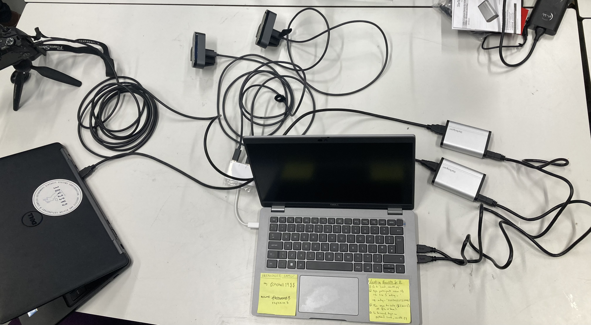

# Mediacentre

Utilities for harmonizing video recording, motivated by needs of the PORTAL project.  Instead of have to start and stop multiple cameras and then retrieve files from different cards, everything is operated and stored in one place.

## Overview

1. Automatically detect supported hardware
2. Preview video sources on screen to verify coverage
3. Record raw video from devices to local disk.  This step uses raw recording, not changing the video codec, to minimize computation overhead at the expense of large file size.  MKV file containers are used to avoid problems if the recording is interrupted.
4. Convert recorded MKV files offline to MP4 files, taking heavy computation but dramatically reducing file size.

## Dependencies

Mediacentre only runs on Linux.  It relies on [ffmpeg](https://ffmpeg.org/) for video recording and transcoding and [video4linux](https://manpages.ubuntu.com/manpages/bionic/man1/v4l2-ctl.1.html) for device detection.  Four stages are involved:

## Supported Hardware

* [Logitech BRIO 4k webcams](https://www.logitech.com/en-gb/products/webcams/brio-4k-hdr-webcam.960-001106.html) will be recorded at 3840x2160 resolution.
* [StarTech UVCHDCAP](https://www.startech.com/en-us/audio-video-products/uvchdcap) HDMI capture devices will record at the supplied resolution at 30fps.  These can be used either for low-overhead screen capture from a control computer or for a digital camera with HDMI output.
* Integrated webcams are recorded at 30fps

## Command line tools

* `source get_sources.sh` auto-detects the available video sources, creating a `sources.txt` file listing the available sources and relevant settings
* `source preview.sh` shows every detected source in a live window on screen
* `source stop.sh` stops all preview and recording processes
* `source record.sh` records raw video from all detected sources.  No video previews are shown, to preserve computation.  A progress display indicates the resource usage of the recording processes and the running file sizes.  Press Ctrl+C to stop.
* `source process.sh` converts all local MKV files to MP4 files using the default H264 codec.
